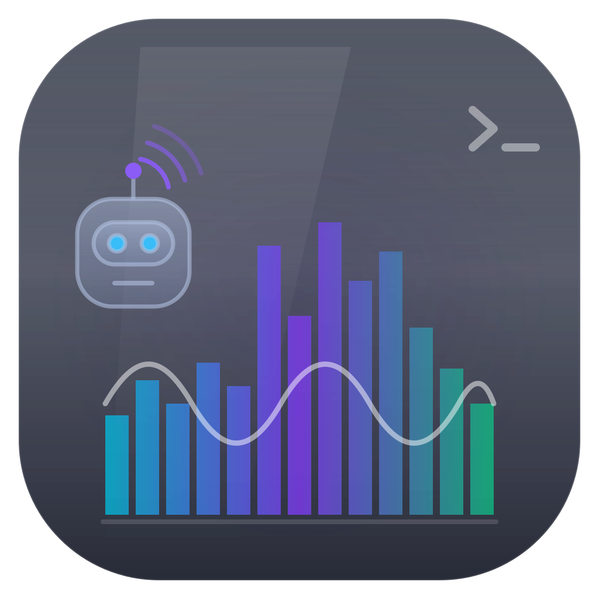

# dsh-pulse · 会话律动状态栏

> 简体中文 · **[English](./README.en.md)**

> **让「盯着 agent」不再枯燥——会话有自己的心跳，跟着律动，调整心情。**


<p align="center"></p>

**dsh-pulse** 是为 [DeepSeek Harness](https://github.com/deepseek-ai/deepseek-harness) Web 界面打造的会话律动状态栏。一条音乐播放器风格的均衡器条带位于 composer 卡片正上方，随当前会话实时律动——流式输出、思考、工具调用、你的输入——配合一组紧凑的状态标签显示网络、等待交互和响应停滞。

标签纵向堆叠（最多两层，超出再向右起新列），几乎不吃均衡器的宽度；「网络正常」标签在活动标签出现时让位（连接警告始终保留）。

## 展示内容

| 通道 | 来源 | 效果 |
| --- | --- | --- |
| 输出速度 | 流式 `partial` 文本增量 | 青色柱 + `输出 N 字符/秒` |
| 思考速度 | 流式 `reasoning` 增量 | 紫色柱 + `思考 N 字符/秒` |
| 工具 | `runningCalls` 变化 | 琥珀柱 + `工具 ×N` |
| 用户输入 | draft 长度增量 | 绿色柱 + `输入 N 字符/秒` |
| 网络 | Host-description 可观测源 | 标签：`网络正常`/`连接中`/`网络重连中`（整条变钢灰） |
| 等待 | pending 交互 | 琥珀色 + `等待确认`/`等待回应` |
| 卡住 | 运行中 8 秒无任何活动 | 红色 + 呼吸闪烁 `响应停滞` |

条带本身是半透明玻璃（backdrop blur、主题自适应），遵循 `prefers-reduced-motion`（空闲呼吸停止，仅真实活动驱动）。所有动画跑在组件自持的 `requestAnimationFrame` 循环上；监听器、循环、观察者随组件一起释放。

文案走 harness 的 locale 系统（`ctx.locale`），所有标签随 GUI 语言设置切换（内置中/英两本词典）。

## 依赖要求

- DeepSeek Harness Web GUI（纯 client 插件，仅浏览器侧）
- harness 的 `web` profile（`@deepseek-ai/dsh-base`、`@deepseek-ai/dsh-web-app`）

## 安装

任意目录执行（profile 会自动创建）：

```sh
# 从 GitHub（推荐；仓库已内置构建好的 lib/，无需构建步骤）
dsh plugin --profile web add github:Joey-Tong/dsh-pulse
# 或本地 checkout（用于开发插件本身）
dsh plugin --profile web add link:/path/to/dsh-pulse
# 或任意已发布的 path/tarball/git 仓库
```

重启 GUI（`dsh web`）让新的 bundle 层生效。状态栏会出现在每个会话的 composer 卡片上方。

> **本仓库可直接安装。** 别人直接运行 `github:Joey-Tong/dsh-pulse` 即可——GitHub 分发拉取的是源码，而 `lib/`（构建产物）已提交且 `exports` 指向它，因此安装时**无需构建步骤、无需 `prepare` 脚本、无需 pnpm `allowBuilds` 门禁**。

## 仓库里哪些是必需的

安装必需的只有三个：`package.json`（插件 manifest + `dsh.bundle`/`dsh.client`）、`cordis.patch.yml`（补丁层）、`lib/`（`exports` 指向的构建产物）。其余——`src/`、`tests/`、`tsconfig*.json`/`tsdown.config.ts` 构建配置、`scripts/`、CI 工作流——是为了开源透明、贡献和 CI，安装时不会被加载。

## 开发

```sh
pnpm install        # 仅开发工具（typescript/tsdown/vitest/lightningcss）
pnpm watch          # 变更时重建 lib/client.js（client HMR / 页面刷新）
pnpm typecheck      # host + client + test 三个 program
pnpm build          # tsc（lib/*.js + lib/types）+ tsdown（lib/client.js）
pnpm test           # meter/palette/geometry 纯逻辑单测
pnpm verify         # typecheck + build + test
```

类型导入仅通过 tsconfig `paths` 指向 `../deepseek-harness` 的本地 checkout；运行时值从不导入——浏览器模块表负责所有运行时依赖（`react`、`@deepseek-ai/cordis`、slots、runtime …），构建期由内置纯度门强校验。因为类型解析指向本地 harness checkout，`pnpm typecheck`/`pnpm build` 需要一份；`pnpm test`（纯逻辑）随处可跑，这也是快速 CI job 所跑的。

### 目录

```
cordis.patch.yml          bundle 层：插入 dsh-pulse 条目
src/index.ts              host 半部分（空 apply；浏览器半部分是插件本体）
src/client/index.ts       client 入口：inject、词典、dock 注册
src/client/PulseBar.tsx   dock 组件：meter 喂入、rAF 循环、chips
src/client/meter.ts       纯会话活动 meter（bump/decay/EMA）
src/client/draw.ts        均衡器几何 + canvas 绘制（纯测试）
src/client/palette.ts     模式切换的色相混合
src/client/locales.ts     中/英词典（namespace `pulse`）
scripts/tsdown.client.ts  移植自官方的 client-bundle 构建器（MIT）
```

## 说明

- 接缝为 `conversation.input.dock`（composer 卡片上方独占一行），由 `@deepseek-ai/dsh-client-ui-conversation` 声明；官方 stats line 保留自己的 `composer.dock` 接缝不受影响。
- 卡住阈值（8s）和标签阈值是 `PulseBar.tsx` 里的常量；当前预览下 client fiber 收不到 patch config，因此暂无配置面。
- 悬停律动条**右上角**并**上下拖动**可等比例缩放高度（0.6x–1.6x），或用键盘 `↑/↓`；偏好按浏览器记忆在 `localStorage`。
- 网络状态来自 `ctx.connection.hostDescription`（连接中为 undefined），不做逐帧轮询。
- MIT 许可。`scripts/tsdown.client.ts` 移植自官方 DeepSeek Harness 构建助手（MIT，© DeepSeek）。

## 贡献

欢迎 PR。推送前请保持 `lib/` 最新（`pnpm build`），以便 Git 安装保持零构建。在 `../deepseek-harness` 处放一份 harness checkout 即可跑 `pnpm verify`；`pnpm test` 独立可跑。

